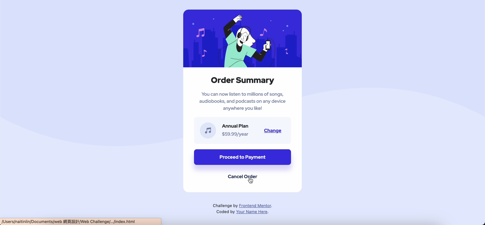

# Frontend Mentor - Order summary card solution

This is a solution to the [Order summary card challenge on Frontend Mentor](https://www.frontendmentor.io/challenges/order-summary-component-QlPmajDUj). Frontend Mentor challenges help you improve your coding skills by building realistic projects. 

## Table of contents

- [Overview](#overview)
  - [The challenge](#the-challenge)
  - [Screenshot](#screenshot)
  - [Links](#links)
- [My process](#my-process)
  - [Built with](#built-with)
  - [What I learned](#what-i-learned)
  - [Continued development](#continued-development)
  - [Useful resources](#useful-resources)
- [Author](#author)
- [Acknowledgments](#acknowledgments)

## Overview
### The challenge
Users should be able to:
- See hover states for interactive elements

### Screenshot




### Links
- Live Site URL: 

## My process
### Built with
- Semantic HTML5 markup
- CSS custom properties
- Bootstrap
- Flexbox
- CSS Grid

### What I learned
grid
網格設計要稍微想一下，但是可以跨行置中非常好用。

transition
用了補間動畫，讓游標離開按鈕時不會顯得太突兀。

```css
.annual-plan {
    border-radius: 0.5rem;
    display: grid;
    grid-template-rows: 50% 50%;
    grid-template-columns: 20% 50% 30%;
}

.annual-plan img {
    grid-row: 1 / 3;
    grid-column: 1 / 2;
    justify-self: center;
}
```
```css
.payment-btn {
    border: 0;
    border-radius: 0.5rem;
    box-shadow: 0 14px 14px 2px hsla(245, 75%, 52%, 0.2);
    display: block;
    font-size: 14px;
    width: 100%;
    padding: 0.8rem 0;
    transition: 0.5s;
}

.payment-btn:hover {
    opacity: 0.8;
}
```

### Continued development
CSS Grid

## Author
- Frontend Mentor - [@YAcodingroom]
(https://www.frontendmentor.io/profile/YAcodingroom)
- Threads - [@nt19_lya](https://www.threads.net/@nt19_lya)

## Acknowledgments
感謝Angela老師，感謝靜文老師，感謝Google，感謝Bootstrap，感謝小水豚工具書，感謝宇宙，感謝自己的每天都花時間練習。
感謝另一半和我的貓總是陪著我coding。
